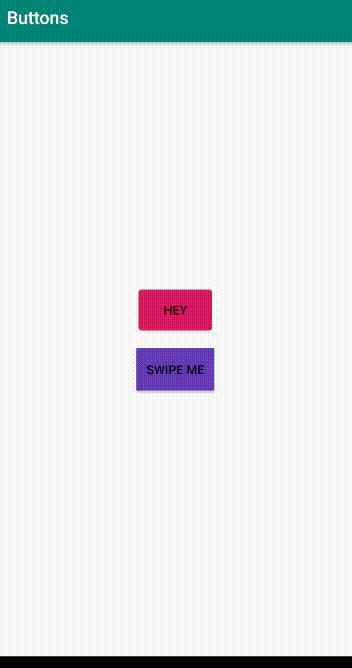

# mybuttons
Some buttons i've made during development of some projects

Morph button attributes  ->
{
morph_button_color - color *
ordinate_bouncing  - height|direction of bouncing
morph_radius  -  radius to fold source shape
morph_height  -  height to fold source shape
morph_width   -  width to fold source shape
bouncing_duration
folding_duration
unfolding_duration
}
these are applicable as random_name:attribute e.g. random_name:morph_button_color="@color/*"

* color attribute looks for resource like R.color.*
other attributes are just values for now

Swipeable button -> {
    to use it just define onSwipeListener of button
}